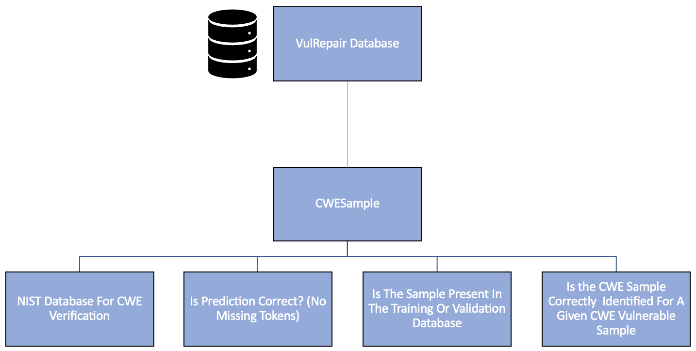

  </a>
  <h3 align="center">CWERepair</a></h3>
  

    Revisiting Zero-Shot For Real-World Software Vulnerability Repair
  

Abstract—A record number of security vulnerabilities have
been reported to the Common Vulnerability Enumeration (CVE)
database in the last couple of years. These security vulnerabilities
are of different types that vary in complexity. The record number
of security vulnerabilities and complexity is in dire need of
automation to help developers reduce the time lag between re-
porting and fixing the vulnerabilities. Researchers have designed
and applied multiple machine learning-based systems to help
security developers fix vulnerabilities. However, these models
face various problems, such as reliance on large confirmed
vulnerability datasets, limited input, and output window size,
generalization on unknown and complicated bugs, and need
considerable time to generate plausible patches for a single bug.
This makes them impractical to be used in real life. On top of
that, we are still unclear if these tools work best for certain
types of security bugs. One solution is directly leveraging large
code language models (LLMs) trained on billions of text/code
tokes. LLMs have been applied on small programs related to
general software bugs and have shown promising results, but
security bugs are different as they are notoriously complicated.
In this work, we are interested in evaluating recently developed
Codex LLMs and comparing them with state-of-the-art fine-
tuned LLMs and DL-based models. This paper is the first to
study and compare the fixing capabilities of newly developed
LLMs on real-world vulnerabilities and assess the practicality of
these models.

  
  ## Papers In Question
  

- **CVEfixes:** automated collection of vulnerabilities and their fixes from open-source software; Year: Aug.19, 2021; Conference: 17th International Conference on Predictive Models and Data Analytics in Software Engineering (PROMISE)
- **VRepair:** Neural Transfer Learning for Repairing Security Vulnerabilities in C Code; Year: Feb. 1, 2022; Conference: IEEE Transactions on Software Engineering
- **VulRepair:** A T5-Based Automated Software Vulnerability Repair; Year: Nov 7, 2022; Conference: 30th ACM Joint European Software Engineering Conference and Symposium on the Foundations of Software Engineering (ESEC/FSE)
- **Pre-trained Model-based Automated Software Vulnerability Repair: How Far are We?:** Year: Aug. 28, 2023; Conference: IEEE Transactions on Dependable and Secure Computing
- **DiverseVul:** A New Vulnerable Source Code Dataset for Deep Learning Based Vulnerability Detection; Year: Oct. 16, 2023; Conference: 26th International Symposium on Research in Attacks, Intrusions and Defenses (RAID)

  
  ## CWESample-Verification-Steps
  

- **VulRepair Database:** Get the testing sample from the VulRepair Database.
- **NIST Website:** Second Step is to very the CWE type of the given sample using CVEID (CVE-YEAR-SAMPLE) from NIST Webisite: https://www.nist.gov/ .
- **Raw Prediction:** Verify the raw prediction of the VulRepair with the target.
- **Sample Presence:** Is the sample present in the traning or validation set of the VulRepair database?
- **Sample Identification** The sample is manually verified for CWE identification based on the given target.

## Analysis and Takeaway

### Top 25 Most Dangerious [12 CWEs]
- **NIST Verification:** 4/35 (Incorrect CWE Identification)
- **Training and Validation Samples Verification:** 32/35 (Present in Train or Validation Dataset)
- **CWE Identification:** 18/35 (Incorrect or Unverifiable)
  
**Detailed Analysis:** <a href="https://github.com/Anurag-Swarnim-Yadav/CWERepair/blob/main/O5_Analysis_on_top25_most_dangerious_repair_by_Vulrepair/Top_25_Most_Dangerous/README_Top_25_Most_Dangerous_Analysis.md">Top 25 Most Dangerious CWEs</a>

**Note:** Excluding 4 Duplicate Samples

### Top-10 Most Accurately Repaired CWE Types of VulRepair
- **NIST Verification:** 2/23 (Incorrect CWE Identification)
- **Training and Validation Samples Verification:** 21/23 (Present in Train or Validation Dataset)
- **CWE Identification:** 12/23 (Incorrect or Unverifiable)

 **Detailed Analysis:** <a href="https://github.com/Anurag-Swarnim-Yadav/CWERepair/blob/main/O4_Analysis_on_top10_most_accurately_repair_by_Vulrepair/README_Top_10_Most_Accurate_Repair_Analysis.md">Top-10 Most Accurately Repaired CWEs</a>
 
**Note:** Excluding 1 Duplicate Sample.

**Takeaway:** We have 0 perfect sample that we can use for comparision. 

<!-- Extra Stuff. I might consider later -->
<!-- 

text-davinvi-003: without-buggy-line

<h3>
    <b>
        

            Performance on Top- 10 Most Dangerous CWEs in 2021
        

    </b>
</h3>
  

| Rank | CWE Type | Name                                                                                       | Count | VRepair | VulRepair | CWERepair |
|------|----------|--------------------------------------------------------------------------------------------|-------|---------|-----------|-----------|
| 1    | CWE-787  | Out-of-bounds Write                                                                        | 53    |         | 16        |           |
| 2    | CWE-79   | Improper Neutralization of Input During Web Page Generation ('Cross-site Scripting')       | 1     |         | 0         |  0        |
| 3    | CWE-125  | Out-of-bounds Read                                                                         | 170   |         | 54        |           |
| 4    | CWE-20   | Improper Input Validation                                                                  | 152   |         | 68        |           |
| 5    | CWE-78   | Improper Neutralization of Special Elements used in an OS Command ('OS Command Injection') | 3     |         | 1         |           |
| 6    | CWE-89   | Improper Neutralization of Special Elements used in an SQL Command ('SQL Injection')       | 5     |         | 1         |  0        |
| 7    | CWE-416  | Use After Free                                                                             | 55    |         | 29        |           |
| 8    | CWE-22   | Improper Limitation of a Pathname to a Restricted Directory ('Path Traversal')             | 8     |         | 2         |           |
| 9    | CWE-352  | Cross-Site Request Forgery (CSRF)                                                          | 2     |         | 0         |           |
| 10   | CWE-434  | Unrestricted Upload of File with Dangerous Type                                            | -     | -       | -         |           |

text-davinvi-003: with-buggy-line

<h3>
    <b>
        

            Performance on Top- 10 Most Dangerous CWEs in 2021
        

    </b>
</h3>
  

| Rank | CWE Type | Name                                                                                       | Count | VRepair | VulRepair | CWERepair |
|------|----------|--------------------------------------------------------------------------------------------|-------|---------|-----------|-----------|
| 1    | CWE-787  | Out-of-bounds Write                                                                        | 53    |         | 16        |           |
| 2    | CWE-79   | Improper Neutralization of Input During Web Page Generation ('Cross-site Scripting')       | 1     |         | 0         |  0        |
| 3    | CWE-125  | Out-of-bounds Read                                                                         | 170   |         | 54        |           |
| 4    | CWE-20   | Improper Input Validation                                                                  | 152   |         | 68        |           |
| 5    | CWE-78   | Improper Neutralization of Special Elements used in an OS Command ('OS Command Injection') | 3     |         | 1         |           |
| 6    | CWE-89   | Improper Neutralization of Special Elements used in an SQL Command ('SQL Injection')       | 5     |         | 1         |  1        |
| 7    | CWE-416  | Use After Free                                                                             | 55    |         | 29        |           |
| 8    | CWE-22   | Improper Limitation of a Pathname to a Restricted Directory ('Path Traversal')             | 8     |         | 2         |           |
| 9    | CWE-352  | Cross-Site Request Forgery (CSRF)                                                          | 2     |         | 0         |           |
| 10   | CWE-434  | Unrestricted Upload of File with Dangerous Type                                            | -     | -       | -         |           |

 
-->

